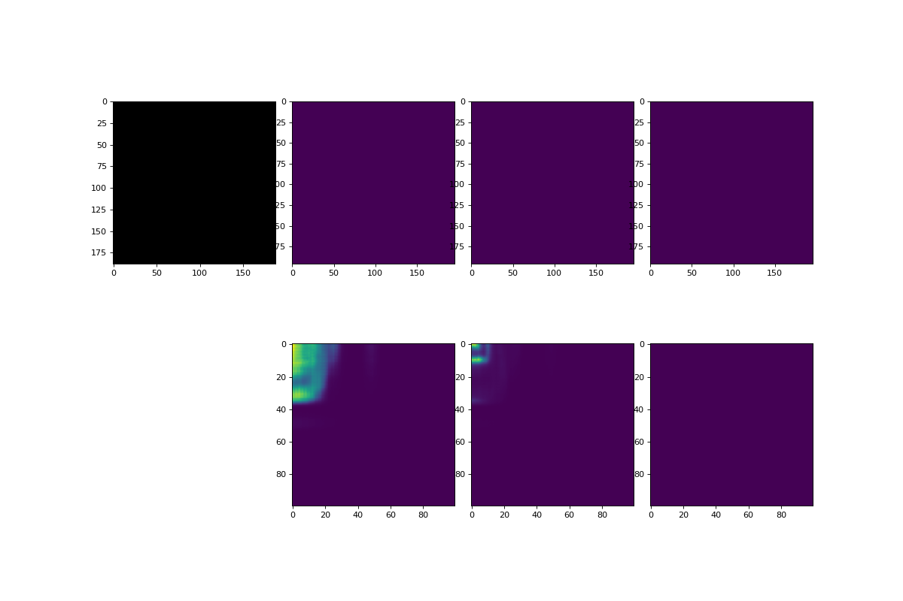

# do-u-net
Implementation of do-u-net AI model for future studies



## Setting up

> Python 3.7 is required
1. Clone the repo
```bash
git clone https://github.com/nemo256/do-u-net
```
2. Setup python virtual environment
```bash
pip install virtualenv
python -m venv venv
source venv/bin/activate
```
3. Install all the requirements
```bash
pip install -r requirements.txt
```

## Training the model

> Alternatively contact me to get the best weights
1. Clone the repo
```bash
python src/run.py
```
